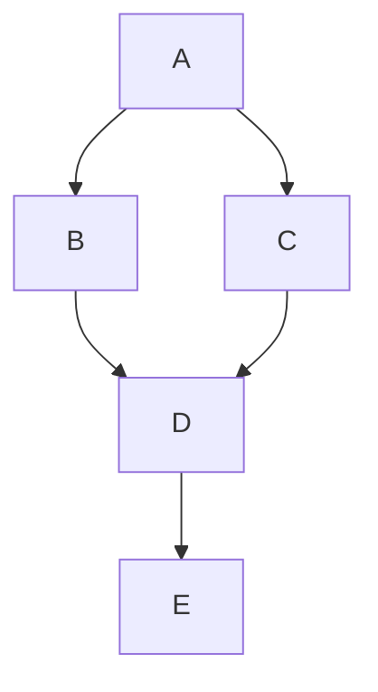

Title: MCP (Model Context Protocol)
Date: 2025-03-15 10:10
Modified: 2025-03-15 10:30
Category: CS
Tags: Protocol
Status: published

# MCP Overview

由Anthropic公司（Claude的创造者）于2024年11月推出的开放协议，正在重新定义AI与数字世界的交互方式。如果说ChatGPT打开了智能对话的大门，那么MCP则正在为AI装上"操作现实的双手"。

MCP（Model Context Protocol）是一种开放标准协议，旨在让大型语言模型（LLM）与外部工具和数据源无缝通信。用个简单的比喻，MCP 就像是 AI 的“通用翻译器”，让它能安全、可控地访问你的文件、应用或网络服务，并执行具体任务。


**MCP 的三大核心组件**

- **MCP 主机**：与 AI 互动的应用程序，比如 Claude Desktop，相当于 AI 的“大本营”
- **MCP 服务器**：专门的小程序，提供特定功能（如访问文件或调用 API），就像为 AI 服务的“专业导游”
- **MCP 客户端**：连接主机和服务器的桥梁，确保通信顺畅，通常无需用户直接操作


MCP 建立在灵活、可扩展的客户端-服务器架构之上，让 LLM 与外部资源无缝通信。




```python
print("Hello, World!")
```
